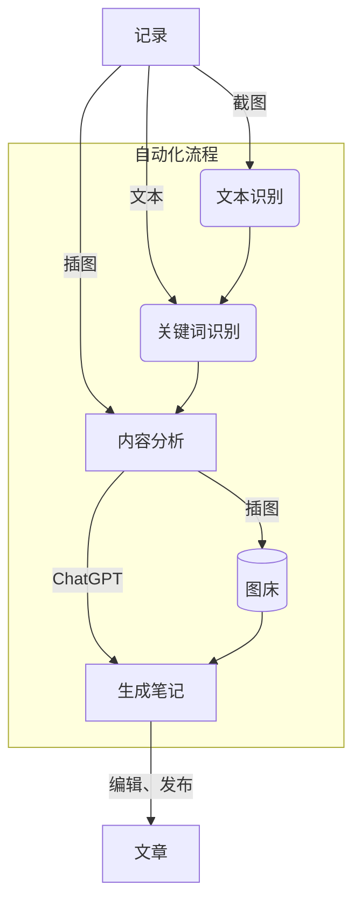

# NoteGen

NoteGen 是一个基于 Tauri + ChatGPT 的笔记软件，旨在帮助用户通过截图（核心）或文本复制的方式，快速记录知识片段，从而降低学习时对整体思路的影响。

当完成记录后，它会借助 ChatGPT 自动帮你整理出一篇可读的笔记，随后你可以通过自带的 markdown 编辑器将其整理为文章。

## 特性

- 记录方式：截图、文本（待实现）、插图（待实现）
- OCR 识别
- 关键词分析
- 整理笔记
- 文章管理器
- 收藏夹（待实现）
- 图床（待实现）
- 全局搜索（待实现）
- 回收站（待实现）
- 历史记录（待实现）
- 平台管理（待实现）
- 帮助（待实现）
- 系统设置（待实现）

## 工作流

NoteGen 致力于大幅降低记录和整理的时间成本，将其自动化实现。



> 整个自动化流程走下来，已经整理出一篇可读性不错的笔记。

## MACOS

暂时还未申请苹果开发者，无法打开使用以下命令：

```sh
sudo xattr -rds com.apple.quarantine /Applications/note_gen.app
```